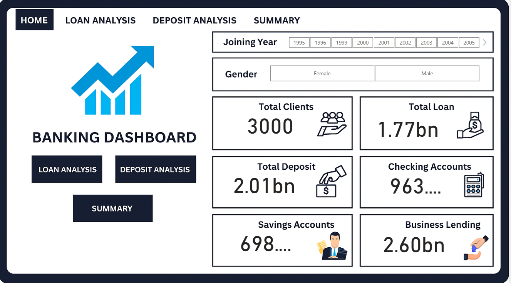
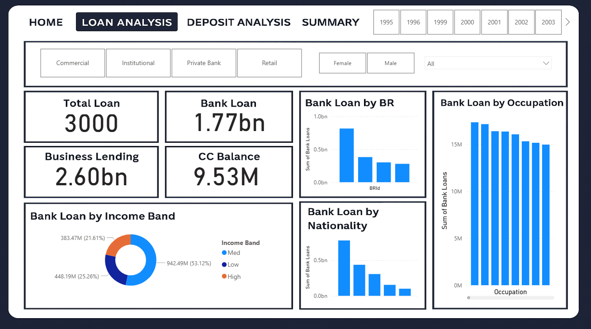
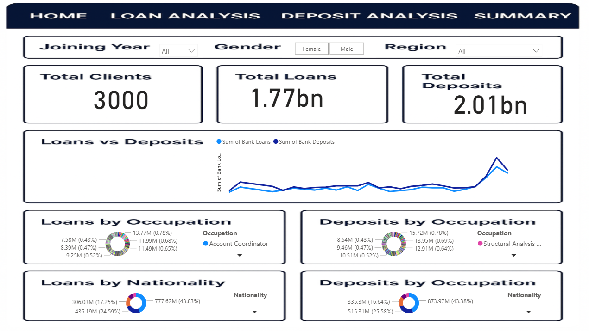

# Description
An end-to-end data pipeline and analytics solution that empowers banks to track deposits, loans, client accounts, and business lending performance using:

🐍 Python → Data ingestion & transformation

🗄️ SQL (SQLite) → Centralized database storage

📊 Power BI → Interactive dashboard & visual storytelling

This project helps financial institutions minimize lending risks, monitor client portfolios, and make data-driven decisions.

# Problem Statement

In banking and financial services, one of the biggest challenges is lending risk — the possibility that a customer may not repay the loan.

👉 The goal is to develop a basic understanding of risk analytics and explore how data can be used to minimize financial losses by analyzing client behavior, demographics, and past transactions.

# Solution

Our Banking Dashboards (Power BI) leverage the latest tools to:

✔️ Analyze applicant profiles (demographics, deposits, account history)
✔️ Predict loan repayment likelihood
✔️ Assist decision-makers in approving or rejecting loans based on risk
✔️ Provide real-time insights into overall loan, deposit, and account health

This ensures smarter lending decisions, reduces default risks, and improves banking profitability.

# Key Features
🔹 Automated Data Pipeline (Python & SQL)

Ingests raw banking data (CSV/Excel) into SQLite (banking_db.py)

Transforms data into a cleaned & structured banking summary (get_banking_summary.py)

Calculates core banking metrics:

👥 Total Clients

💰 Total Loan & Deposits

🏦 Checking, Savings & Business Lending Accounts

📈 Loan-to-Deposit Ratio

📊 Deposit & Loan Growth Rates

💵 Average Account Balance

🚻 Client Demographics (e.g., Gender distribution)

# Exploratory Data Analysis (Jupyter)

Banking Performance Analysis.ipynb

ExploratoryBankingData.ipynb

Includes:
✅ Data cleaning & preprocessing
✅ Descriptive statistics of deposits & loans
✅ Visualization of account types & balances
✅ Client segmentation & insights

🔹 Interactive Power BI Dashboard

Modern Banking Dashboard with:

🏆 KPI Cards → Total Clients, Loans, Deposits

📊 Top Products/Accounts → Checking vs. Savings vs. Business Lending

🛑 Low Deposit Clients Table → Top 10 lowest deposit holders

🔎 Drill-through Navigation → From overview → deep dive into accounts/clients

🎨 Formatted visuals → Bold headers, KPI formatting, word wrap, filters

🔐 Risk Analytics Module → Loan approval decision-making support

# Project Structure
banking-dashboard-analytics/
│── data/                          # Raw banking data (CSV/Excel)
│── logs/                          # Pipeline & process logs
│── banking_db.py                  # Data ingestion script
│── get_banking_summary.py         # Transformations & metrics
│── Banking Performance Analysis.ipynb  # Analytics notebook
│── ExploratoryBankingData.ipynb   # Exploratory Data Analysis (EDA)
│── BankingDashboard.pbix          # Power BI Dashboard file
└── README.md                      # Documentation

# How to Run
# 1️⃣ Clone the Repository
git clone https://github.com/zoyaghazal45/banking-dashboard-analytics.git
cd banking-dashboard-analytics

# 2️⃣ Install Dependencies
pip install -r requirements.txt

(Requirements: pandas, sqlalchemy, sqlite3, matplotlib, seaborn, logging)

# 3️⃣ Ingest Data

Place your banking data files inside the data/ folder.

Run:

python banking_db.py

# 4️⃣ Generate Banking Summary
python get_banking_summary.py

✔️ Creates a table banking_summary inside banking.db.

# 5️⃣ Explore in Jupyter Notebooks

Open Banking Performance Analysis.ipynb or ExploratoryBankingData.ipynb

Run cells for stats, insights & visualizations

# 6️⃣ Open the Power BI Dashboard

Open BankingDashboard.pbix in Power BI Desktop

Refresh connection to banking.db

# Explore via:

📌 Drill-through navigation

📊 Interactive filters

👤 Client-level deep dives

🔐 Loan approval decision analysis

# Screenshots:

